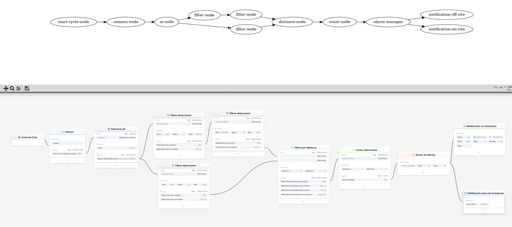

## workflow-json-interpreter

This repo aims to build a logic workflow from a json file. It interprets the json file and builds a directed acyclic graph (DAG) in python that represents the workflow. Then, it executes the workflow.

## Usage:

1. Install the required dependencies:
``` 
pip install -r requirements.txt
```
2. Place the json file in the `workflows/` folder and check the json path in `main.py` file.

3. Run the script:
```
python main.py
```

### Example DAG Visualization

Below is an example visualization of a workflow DAG:



The graph shows the nodes (workflow steps) connected by directed edges indicating the execution flow. Each node is labeled with its schema ID representing the operation to be performed.

Key features shown in the visualization:
- Nodes represent individual processing steps
- Directed edges show dependencies and execution order
- Left-to-right layout for clear flow visualization
- Node labels indicate the operation type (schema ID)


## TODO:
- Interpretar el json con python.
- Construir el DAG con python y gestionar asi el orden de ejecucion e inputs y outputs
- Gestionar la concurrencia de ramas del DAG.
- Definir funciones no mockeadas con parametros, inputs y outputs razonbales.
- Poner prints de orden de ejecucion con time sleeps para ver que va todo bien.
- Terminar las funciones bien y control de errores.
- Sofisticar las funciones de sensibildiad distancia y control de errores.
- Validar para varios worflows posibles.
- Mirar de hacer eficientes las peticiones a la API.
- Dockerizar y asegurar que no se detenga nunca.
